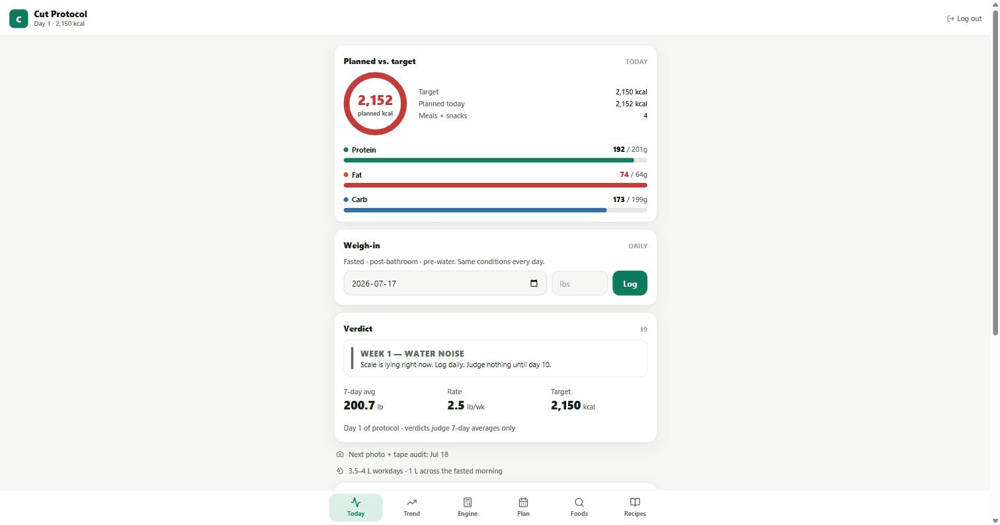
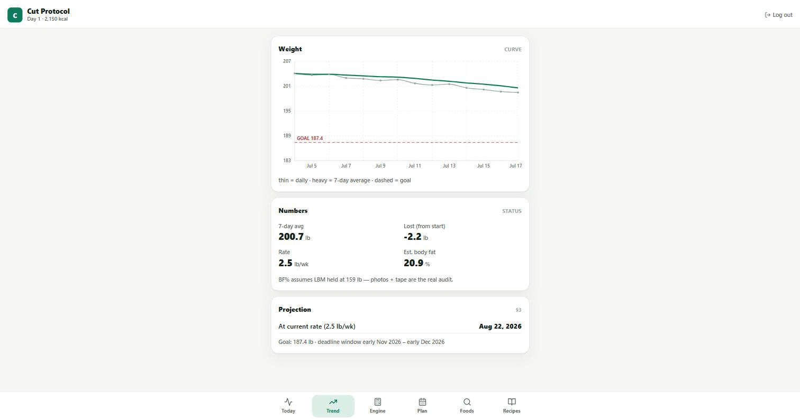
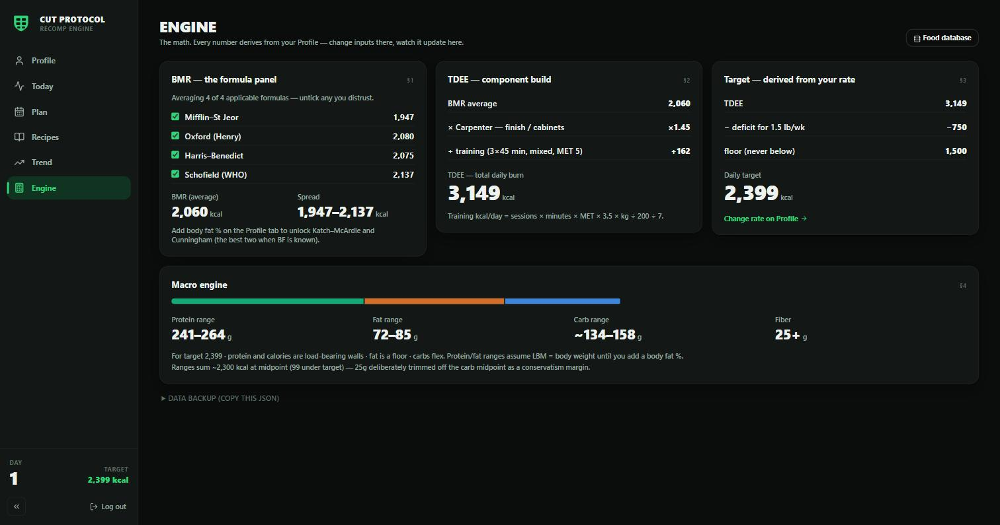
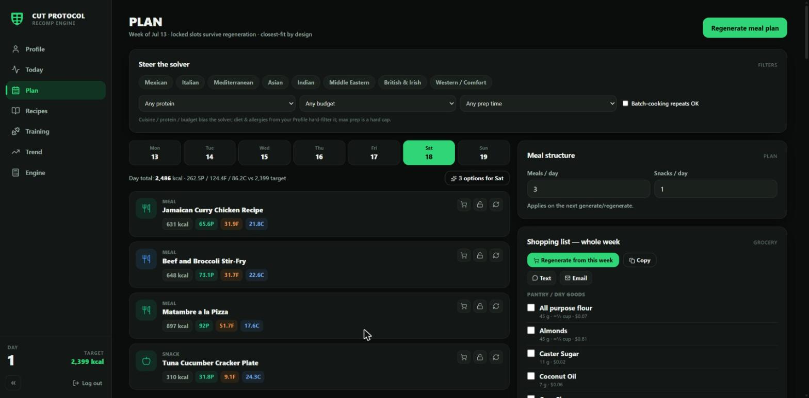
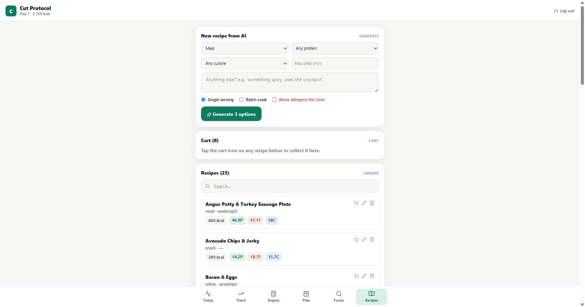

# Cut Protocol

[](https://github.com/AlbertanCoder/cut-protocol/actions/workflows/ci.yml)

A cutting-focused nutrition coach — calibrated calorie targets, AI-assisted weekly meal planning, and honest weigh-in trend tracking.

## What it does

Cut Protocol is built for someone running a calorie deficit who wants the math shown, not hidden. Once you're logged in, it:

- Computes your BMR/TDEE from **six independent formulas** (Mifflin–St Jeor, Oxford/Henry, Harris–Benedict, Katch–McArdle, Cunningham, and Schofield/WHO) and takes the median rather than trusting any single one.
- Sets calorie and protein/fat/carb targets from your goal, with a hard floor you can't accidentally drop below.
- Generates a full week of meals from a recipe library using a deterministic solver that fits each slot to your calorie and protein targets — with an AI-assisted option (via the Anthropic API) for generating new recipes on demand.
- Filters every recipe and generated meal through your dietary style and food exclusions/allergies before it's ever shown to you.
- Builds a real grocery list from your week's plan: raw/dry purchase quantities (not just as-cooked grams), grouped by store section, with rough cost estimates.
- Tracks daily weigh-ins, smooths them into a 7-day trend, and gives a plain verdict — hold, step down, or add calories back — instead of reacting to daily scale noise.
- Runs as a normal web app, or as a packaged Windows desktop app via Electron.

## Features

- Six-formula BMR/TDEE engine, medianed for a more stable estimate
- Calorie floor enforcement
- Weekly AI-assisted meal plan generator with a real calorie/protein-fit solver
- Recipe library with per-recipe macros, editable ingredients, and AI-generated variants
- Dietary style + allergy/exclusion filtering applied before recipes ever reach you
- Grocery list generation with store-section grouping and cost estimates
- Cart for collecting recipes into a combined shopping list
- Weigh-in log with 7-day rolling average, rate-of-loss verdicts, and milestone/maintenance-break coaching
- USDA FoodData Central integration for verified nutrition data
- Windows desktop build via Electron, alongside the standard web app

## Tech stack

- **Backend:** Node.js, Express 5, Prisma 6 (SQLite in dev), JWT auth
- **Frontend:** React 19, Vite 8, Tailwind CSS 4, Recharts
- **Desktop:** Electron + electron-builder (Windows installer)
- **AI:** Anthropic API for recipe generation
- **Nutrition data:** USDA FoodData Central API

## Setup & running locally

Prereqs: Node.js and npm.

**1. Clone and install dependencies:**

```
git clone <repo-url>
cd cut-protocol
npm install
cd backend && npm install
cd ../frontend && npm install
```

**2. Configure the backend:**

```
cd backend
cp .env.example .env
```

Fill in `backend/.env`:
- `JWT_SECRET` — generate one with `node -e "console.log(require('crypto').randomBytes(32).toString('hex'))"`
- `USDA_API_KEY` — free key from [fdc.nal.usda.gov/api-key-signup](https://fdc.nal.usda.gov/api-key-signup)
- `ANTHROPIC_API_KEY` — from [console.anthropic.com](https://console.anthropic.com)
- `SEED_EMAIL` / `SEED_PASSWORD` — your own login, used once by the seed step below

**3. Set up the database and seed an account:**

```
npx prisma generate
npx prisma migrate deploy
npm run seed
npm run seed:recipes
```

**4. Run it (two terminals):**

```
cd backend && npm run dev      # :3001
cd frontend && npm run dev     # :5173, proxies /api to :3001
```

Open `http://localhost:5173` and log in with the account you just seeded.

### Desktop build (optional)

From the repo root: `npm install`, then `npm run dist` builds a Windows installer via Electron.

## Screenshots

**Today** — daily target vs. planned macros, weigh-in log, and a rate-of-loss verdict.


**Trend** — 7-day weight average, projected goal date, and body-fat estimate.


**Engine** — BMR/TDEE inputs, dietary preferences, and the underlying formula breakdown.


**Plan** — an AI-assisted, solver-fit weekly meal plan.


**Recipes** — the recipe library, AI recipe generation, and cart.


---

© 2026 Shad. All rights reserved. This project is shared for demonstration purposes; please don't reuse the code without permission.
