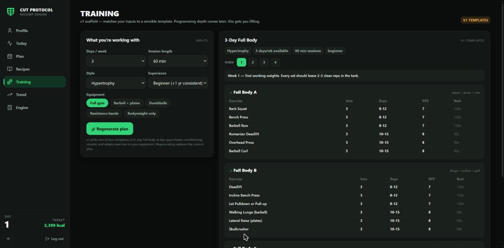

# Cut Protocol

A nutrition app I'm building on the side. Work in progress — this is a project page, not a product launch.

 

## The problem

Most people who decide to lose weight don't fail because they're lazy. They fail because dieting asks them to do things nobody taught them: figure out how many calories they actually burn, translate that into a daily target, split it into protein, fat, and carbs, and then somehow turn those numbers into real meals — every day, indefinitely. Every step is either confusing or tedious, so people guess, get inconsistent results, and quit.

## What Cut Protocol does about it

You punch in your stats (height, weight, age), what you do for work, and how you train. It calculates your calories and macros — using several published BMR formulas averaged together rather than trusting any single one, with the math shown on screen so you can check it. Then it generates weekly meal plans and recipes that actually fit your numbers, builds the grocery list, and tracks your weigh-ins against the plan so you can see whether it's working.

The design bias throughout is honesty over polish: if the meal solver can't hit your targets, it says so and names the constraint instead of quietly missing. If a number is an estimate, it's labeled as one.

## Where it's at

**Works today**

- Calorie/macro engine: six BMR formulas (averaged, individually excludable, spread shown), TDEE built from a 36-occupation activity table plus training load, and a daily target derived from your chosen rate of loss — clamped to a safety floor, recomputed as your weigh-ins move
- Weekly meal-plan solver: scored day candidates against your calories and protein, portion scaling, swap-with-alternates, slot locking, and plain-language diagnosis when targets are genuinely out of reach
- Recipe library (600+): grouped browsing, search, protein-density sort; dietary styles and allergy filters applied server-side before anything reaches you
- Recipe import from the web (reads standard schema.org markup, converts amounts to grams with estimates flagged) and AI-assisted recipe generation, both gated by the same nutrition validator as every other food
- Grocery lists with raw-purchase quantities, store sections, and labeled rough cost estimates
- Daily weigh-in tracking with a 7-day trend, pace verdicts, and a projected goal date
- Runs as a web app or a packaged Windows desktop app (Electron)

**Rough / early**

- Training: a v1 scaffold behind a feature flag — it matches your days, equipment, and experience to one of four sensible workout templates. Deliberately simple; real programming depth is future work
- Cost estimates cover common staples only; the price table is thin
- Single-user by design right now — auth exists, but this is built as a personal tool first

**Ideas for later** (ideas, not promises)

- A proper food diary (logging what you actually ate, not just what was planned)
- Smarter workout suggestions
- Barcode scanning for packaged foods
- Maybe a store release someday, if it ever feels ready

## Screenshots

**Today** — planned intake vs. target, weigh-in, and the trend at a glance.

**Plan** — the weekly meal plan: steer the solver, swap meals, build the grocery list.

**Engine** — the math, shown: every formula, the TDEE build, and where the daily target comes from.

**Training** — the v1 template scaffold.

## How the engine works, in plain language

1. **BMR** — what your body burns at rest. There are several published formulas for estimating it and they disagree, so Cut Protocol calculates the ones that apply to you (four by default; two more unlock if you know your body-fat %) and averages them, showing the spread.
2. **TDEE** — what you burn in a day. BMR gets multiplied by an activity factor picked from a table of real occupations (a framer burns more than an accountant), then training calories are added from how often and how long you work out.
3. **Target** — TDEE minus the deficit for the loss rate you chose. One pound a week needs about a 500-calorie daily deficit. The result is clamped to a safety floor the app will not go below, and if you pick an aggressive rate it makes you acknowledge that explicitly.
4. **Macros** — protein is set high to protect muscle in a deficit, fat gets a floor, carbs flex to fill what's left. Shown as ranges, not false-precision single numbers.
5. **The loop** — you weigh in daily, the app smooths it into a 7-day average, compares your measured rate against the plan, and re-derives the target as your weight changes. Your actual data beats the model's prediction.

## Tech stack

- **Backend:** Node.js, Express 5, Prisma 6 (SQLite), JWT auth
- **Frontend:** React 19, Vite 8, Tailwind CSS 4, Recharts
- **Desktop:** Electron + electron-builder (Windows installer)
- **Nutrition data:** USDA FoodData Central (source of truth), with a validated 850+ food database
- **AI:** Anthropic API for recipe generation (validator-gated)
- **Tests/CI:** node:test (130 tests), oxlint, GitHub Actions

## About this project

I work construction. This is what I do at night and on days off — I find it genuinely fascinating what one person can build now with AI development tools, and this repo is me finding out. It's built in the open, phase by phase (the commit history is the honest record), and it will be a work in progress for a while.

Not affiliated with any company. Not medical advice — it's a calculator and a meal planner; talk to a professional about your health.

---

© 2026 Shad. All rights reserved. Shared for demonstration purposes — please don't reuse the code without permission.
